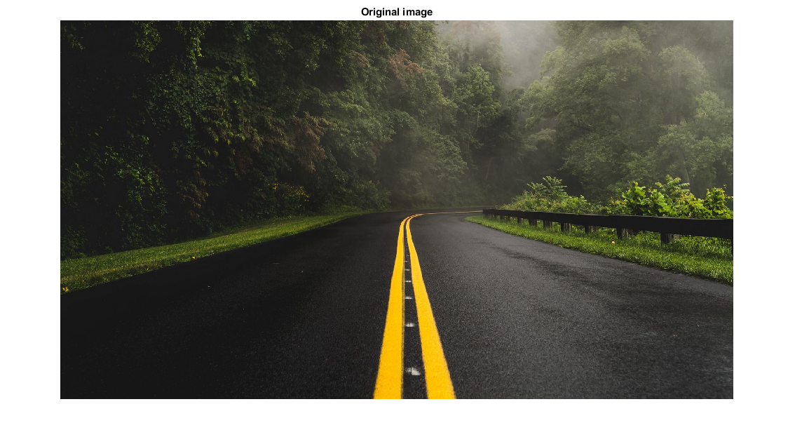
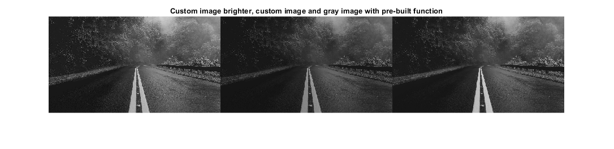

# Image Processing - MATLAB

> Small repository for Image Processing
> Coded on first week at Fontys University

Contents
--------

*   [Read images / convert to gray](#1)
*   [For Loop to turn image into gray](#2)
*   [Save Image](#3)
*   [Brighten image](#4)
*   [Final results](#5)

Read images / convert to gray
-----------------------------

imtest = imread( 'test\\img.jpg' );
gray = im2gray(imtest);
imshow(imtest);
title("Original image");
% Get size of the image in pixels
\[x, y, c\] = size(imtest);

For Loop to turn image into gray
--------------------------------

for i=1 : x
    for j=1 : y
        pixel = imtest(i, j, 1) \* 0.3 + imtest(i, j, 2) \* 0.3 + imtest(i, j, 3) \* 0.3;
        imtest(i, j, 1) = pixel;
        imtest(i, j, 2) = pixel;
        imtest(i, j, 3) = pixel;
    end
end

Save Image
----------

imwrite(imtest, "test/imgtest.png");
imwrite(gray, "test/imggray.png");

Brighten image
--------------

brightImage = imread("test/imgtest.png");
brightImage = imlocalbrighten(brightImage, 0.2);
imwrite(brightImage, "test/imgbright.png");

Final results
-------------

montage( {brightImage, imtest, gray}, "Size", \[1 3\]);
title("Custom image brighter, custom image and gray image with pre-built function");

  
[Published with MATLAB® R2020b](https://www.mathworks.com/products/matlab/)

